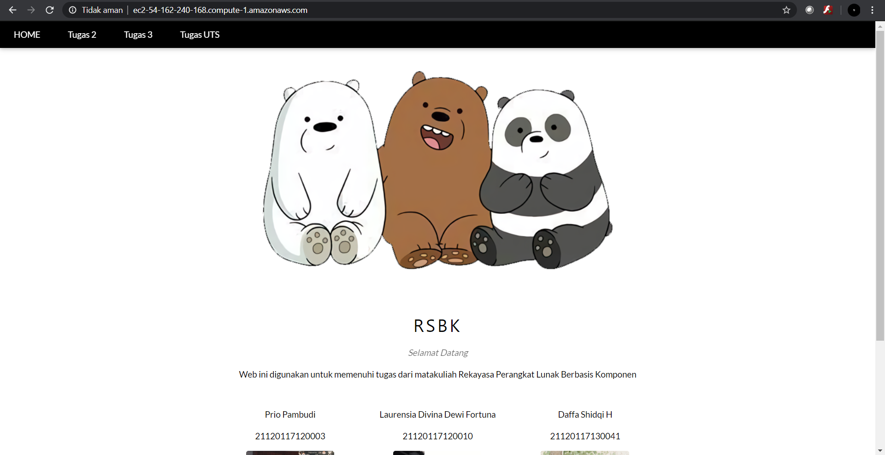
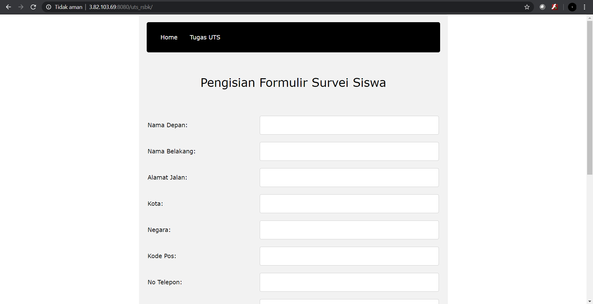

# Tugas UTS RSBK

anggota :
* Prio Pambubdi					21120117120003
* Daffa Shidqi H				21120117130041
* Laurensia Divina Dewi Fortuna	21120117120010


## Instalasi

Local Server

* Import uts_rsbk.war file ke dalam Eclipse
* Jalankan Server Payara
* Klik kanan pada project >> Run As >> Run on server
* Pada browser ketik: http://localhost:8080/uts_rsbk/formsiswa.xhtml

### URL S3 / HomePage
```
ec2-54-162-240-168.compute-1.amazonaws.com
```

### URL EC2 instance
```
http://3.82.103.69:8080/uts_rsbk/
```

## Screenshoot


